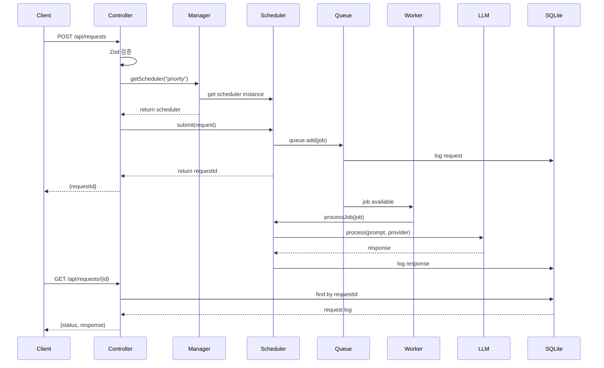

# 04. 컴포넌트 상호작용 (Component Interactions)

> **학습 목표:** 이 문서를 읽고 나면 각 컴포넌트가 어떻게 협력하는지 완벽하게 이해할 수 있습니다.

---

## 1. 컴포넌트 아키텍처 개요

### 1.1 계층 구조

```
┌─────────────────────────────────────────────────────────────────┐
│                        Presentation Layer                        │
│  ┌──────────────────┐           ┌──────────────────┐            │
│  │   REST API       │           │   Dashboard      │            │
│  │   (Express.js)   │           │   (Socket.IO)    │            │
│  └──────────────────┘           └──────────────────┘            │
└─────────────────────────────────────────────────────────────────┘
                            ↓↓ 통신 규약 ↓↓
┌─────────────────────────────────────────────────────────────────┐
│                         Application Layer                        │
│  ┌──────────────┐  ┌──────────────┐  ┌──────────────┐          │
│  │   Request    │  │   Scheduler  │  │   Dashboard  │          │
│  │  Controller  │  │  Controller  │  │   Service    │          │
│  └──────────────┘  └──────────────┘  └──────────────┘          │
└─────────────────────────────────────────────────────────────────┘
                              ↓ 사용 ↓
┌─────────────────────────────────────────────────────────────────┐
│                          Domain Layer                           │
│  ┌──────────────┐  ┌──────────────┐  ┌──────────────┐          │
│  │  Scheduler   │  │   LLM        │  │   Manager    │          │
│  │  Factory     │  │   Service    │  │   Factory    │          │
│  └──────────────┘  └──────────────┘  └──────────────┘          │
└─────────────────────────────────────────────────────────────────┘
┌─────────────────────────────────────────────────────────────────┐
│                       Infrastructure Layer                       │
│  ┌──────────────┐  ┌──────────────┐  ┌──────────────┐          │
│  │    메모리     │  │   SQLite    │  │    Ollama    │          │
│  │   (메모리 큐)   │  │   (Logs)     │  │    /API      │          │
│  └──────────────┘  └──────────────┘  └──────────────┘          │
└─────────────────────────────────────────────────────────────────┘
```

### 1.2 핵심 컴포넌트 목록

| 컴포넌트 | 역할 | 주요 의존성 |
|---------|------|-----------|
| **RequestController** | 요청 수신/검증 | SchedulerFactory |
| **SchedulerController** | 스케줄러 관리 | SchedulerManager |
| **DashboardService** | 메트릭 제공 | All Schedulers |
| **SchedulerFactory** | 스케줄러 생성 | Scheduler Types |
| **SchedulerManager** | 스케줄러 수명 관리 | 메모리, SQLite |
| **LLMService** | LLM API 호출 | Ollama, OpenAI |
| **AgingManager** | Priority 기아 방지 | PriorityScheduler |
| **BoostManager** | MLFQ 주기적 부스팅 | MLFQScheduler |
| **TenantRegistry** | WFQ 테넌트 관리 | WFQScheduler |
| **VirtualTimeTracker** | WFQ 가상 시간 | WFQScheduler |
| **FairnessCalculator** | WFQ 공정성 계산 | WFQScheduler |

---

## 2. 요청 처리 흐름

### 2.1 완전한 요청 수명 주기

```
1. 클라이언트 요청
   POST /api/requests
   {
     "prompt": "Explain quantum computing",
     "provider": {"name": "ollama", "model": "llama2"},
     "priority": 1
   }
   ↓
2. Express Router
   app.post('/api/requests', requestController.submitRequest)
   ↓
3. RequestController.submitRequest()
   - Zod 스키마 검증
   - LLMRequest 객체 생성
   ↓
4. SchedulerManager.getScheduler("priority")
   - configured scheduler 반환
   ↓
5. PriorityScheduler.submit()
   - 메모리 큐 Queue에 작업 추가
   - SQLite에 요청 로그 저장
   ↓
6. 메모리 큐 Worker 감지
   - 메모리에서 작업 가져오기
   ↓
7. PriorityScheduler.processJob()
   - LLMService.process() 호출
   ↓
8. LLMService.process()
   - Ollama API 호출
   - 응답 반환
   ↓
9. SQLite에 결과 저장
   - RequestLog 업데이트
   ↓
10. Socket.IO 이벤트 발송
    - 클라이언트에 완료 알림
    ↓
11. 클라이언트 결과 조회
    GET /api/requests/{requestId}
    ↓
12. RequestController.getRequest()
    - SQLite에서 결과 조회
    - 응답 반환
```

### 2.2 데이터 흐름 다이어그램



---

## 3. 스케줄러 생성 및 관리

### 3.1 SchedulerFactory

**역할:** 요청된 타입의 스케줄러 인스턴스 생성

```typescript
export class SchedulerFactory {
  createScheduler(
    type: SchedulerType,
    config: SchedulerConfig,
    llmService: LLMService
  ): IScheduler {
    switch (type) {
      case "fcfs":
        return new FCFSScheduler(config, llmService);
      case "priority":
        return new PriorityScheduler(config, llmService);
      case "mlfq":
        return new MLFQScheduler(config, llmService);
      case "wfq":
        return new WFQScheduler(config, llmService);
      default:
        throw new Error(`Unknown scheduler type: ${type}`);
    }
  }
}
```

### 3.2 SchedulerManager

**역할:** 스케줄러 수명 주기 관리

```typescript
export class SchedulerManager {
  private schedulers: Map<string, IScheduler> = new Map();

  // 스케줄러 생성 및 초기화
  async createScheduler(
    name: string,
    type: SchedulerType,
    config: SchedulerConfig
  ): Promise<void> {
    const llmService = this.llmService;
    const scheduler = this.schedulerFactory.createScheduler(
      type,
      { ...config, name },
      llmService
    );

    await scheduler.initialize();
    this.schedulers.set(name, scheduler);
  }

  // 스케줄러 조회
  getScheduler(name: string): IScheduler {
    const scheduler = this.schedulers.get(name);
    if (!scheduler) {
      throw new Error(`Scheduler not found: ${name}`);
    }
    return scheduler;
  }

  // 모든 스케줄러 종료
  async shutdownAll(): Promise<void> {
    const shutdownPromises = Array.from(this.schedulers.values()).map(
      (scheduler) => scheduler.shutdown()
    );
    await Promise.all(shutdownPromises);
    this.schedulers.clear();
  }
}
```

---

## 4. Priority Scheduler + AgingManager

### 4.1 상호작용 다이어그램

```
PriorityScheduler 초기화
┌─────────────────────────────────────────────────────────────┐
│ PriorityScheduler.initialize()                             │
│  1. 메모리 연결 가져오기                                      │
│  2. 메모리 큐 Queue 생성                                        │
│  3. 메모리 큐 Worker 생성                                       │
│  4. AgingManager 인스턴스 생성                              │
│  5. AgingManager.start() 호출  ───────────────────┐         │
│                                                       ↓       │
│  ┌─────────────────────────────────────────────┐   │       │
│  │ AgingManager.start()                        │   │       │
│  │  1. setInterval(10000ms)                    │   │       │
│  │  2. 주기적 Aging 시작                       │   │       │
│  └─────────────────────────────────────────────┘   │       │
│                                                       ↓       │
│  ┌─────────────────────────────────────────────┐   │       │
│  │ AgingManager.runAging() [10초마다]         │←──┘       │
│  │  1. getWaitingJobs() 호출                  │           │
│  │         ↓                                   │           │
│  │  PriorityScheduler.getWaitingJobs()         │           │
│  │  - 메모리 큐 Queue에서 대기 작업 가져오기      │           │
│  │         ↓                                   │           │
│  │  2. 각 작업의 대기 시간 확인                │           │
│  │  3. 30초 초과 시 우선순위 상향             │           │
│  │         ↓                                   │           │
│  │  PriorityScheduler.updateJobPriority()      │           │
│  │  - 기존 작업 제거                           │           │
│  │  - 새 우선순위로 재추가                     │           │
│  └─────────────────────────────────────────────┘           │
└─────────────────────────────────────────────────────────────┘
```

### 4.2 인터페이스 계약

**PriorityScheduler가 AgingManager에게 제공하는 인터페이스:**

```typescript
export interface IPriorityScheduler {
  // 대기 중인 작업 목록 가져오기
  getWaitingJobs(): Promise<Array<{
    jobId: string;
    priority: RequestPriority;
    queuedAt: Date;
  }>>;

  // 작업 우선순위 업데이트
  updateJobPriority(
    jobId: string,
    newPriority: RequestPriority
  ): Promise<boolean>;
}
```

---

## 5. MLFQ Scheduler + BoostManager

### 5.1 상호작용 다이어그램

```
MLFQScheduler 초기화
┌─────────────────────────────────────────────────────────────┐
│ MLFQScheduler.initialize()                                  │
│  1. 4개 메모리 큐 Queue 생성 (Q0, Q1, Q2, Q3)                  │
│  2. 4개 메모리 큐 Worker 생성                                   │
│  3. BoostManager 인스턴스 생성                              │
│  4. BoostManager.start() 호출  ───────────────────┐         │
│                                                       ↓       │
│  ┌─────────────────────────────────────────────┐   │       │
│  │ BoostManager.start()                        │   │       │
│  │  1. setInterval(60000ms)                    │   │       │
│  │  2. 주기적 Boosting 시작                    │   │       │
│  └─────────────────────────────────────────────┘   │       │
│                                                       ↓       │
│  ┌─────────────────────────────────────────────┐   │       │
│  │ BoostManager.runBoost() [60초마다]         │←──┘       │
│  │  1. boostAllJobs() 호출                    │           │
│  │         ↓                                   │           │
│  │  MLFQScheduler.boostAllJobs()               │           │
│  │  1. Q1, Q2, Q3의 모든 대기 작업 가져오기     │           │
│  │  2. 각 작업을 Q0로 이동                    │           │
│  │     - job.remove()                          │           │
│  │     - metadata.queueLevel = 0               │           │
│  │     - queues[0].add()                       │           │
│  │  3. SQLite에 큐 레벨 업데이트             │           │
│  └─────────────────────────────────────────────┘           │
└─────────────────────────────────────────────────────────────┘
```

### 5.2 Boost 동작 예시

```
초기 상태 (t=0초):
Q0: [JobA, JobB]
Q1: [JobC, JobD, JobE]
Q2: [JobF]
Q3: [JobG]

작업 처리 진행:
- t=0~5초: JobA, JobB 처리 완료
- t=5~30초: Q0 비어있음, Q1의 JobC 처리 중

Boost 발생 (t=60초):
- Q1의 [JobD, JobE] → Q0로 이동
- Q2의 [JobF] → Q0로 이동
- Q3의 [JobG] → Q0로 이동

Boost 후 상태:
Q0: [JobD, JobE, JobF, JobG]
Q1: []
Q2: []
Q3: []

결과: 모든 작업이 공정한 기회 획득
```

---

## 6. WFQ Scheduler + TenantRegistry + VirtualTimeTracker + FairnessCalculator

### 6.1 상호작용 다이어그램

```
WFQ Scheduler 컴포넌트 관계
┌─────────────────────────────────────────────────────────────────┐
│                        WFQScheduler                             │
│  ┌──────────────────────────────────────────────────────────┐  │
│  │                    TenantRegistry                          │  │
│  │  - registerTenant(tenant)                                │  │
│  │  - getTenant(tenantId) → {id, name, tier, weight}        │  │
│  │  - updateTenantWeight(tenantId, newWeight)                │  │
│  │                                                          │  │
│  │  Default Tenants:                                         │  │
│  │  - enterprise: weight=100                                 │  │
│  │  - premium: weight=50                                     │  │
│  │  - standard: weight=10                                    │  │
│  │  - free: weight=1                                         │  │
│  └──────────────────────────────────────────────────────────┘  │
│                           ↓ getTenant(tenantId)               │
│  ┌──────────────────────────────────────────────────────────┐  │
│  │                 VirtualTimeTracker                        │  │
│  │  - calculateVirtualFinishTime(reqId, tenantId,           │  │
│  │                              serviceTime, weight)          │  │
│  │    → {virtualStartTime, virtualFinishTime}               │  │
│  │  - updateVirtualTime(actualTime, totalWeight)            │  │
│  │                                                          │  │
│  │  Formula:                                                 │  │
│  │  VirtualFinishTime = VirtualStartTime + (ServiceTime/Weight) │  │
│  └──────────────────────────────────────────────────────────┘  │
│                           ↓ recordCompletion()                │
│  ┌──────────────────────────────────────────────────────────┐  │
│  │                FairnessCalculator                        │  │
│  │  - recordRequestCompletion(tenantId, procTime, waitTime) │  │
│  │  - getFairnessMetrics() → {jainsIndex, score, tenants}  │  │
│  │                                                          │  │
│  │  Formula:                                                 │  │
│  │  J = (Σxi)² / (n × Σxi²)                                  │  │
│  │  where xi = average service time for tenant i            │  │
│  └──────────────────────────────────────────────────────────┘  │
└─────────────────────────────────────────────────────────────────┘
```

### 6.2 요청 처리 흐름

```typescript
// 1. 요청 제출
async submit(request: LLMRequest) {
  // TenantRegistry에서 테넌트 조회
  const tenantId = request.metadata?.tenantId || "default";
  const tenant = this.tenantRegistry.getTenant(tenantId);
  const weight = tenant.weight;  // 예: 100

  // VirtualTimeTracker로 가상 완료 시간 계산
  const vft = this.virtualTimeTracker.calculateVirtualFinishTime(
    request.id,
    tenantId,
    5000,    // 예상 서비스 시간 5초
    weight   // 가중치 100
  );
  // vft = {
  //   virtualStartTime: 0,
  //   virtualFinishTime: 0 + (5000/100) = 50
  // }

  // 메모리 큐 큐에 추가 (우선순위 = 가상 완료 시간)
  await this.queue.add(job.name, jobData, {
    priority: Math.floor(vft.virtualFinishTime),  // 50
  });
}

// 2. 작업 처리
private async processJob(job) {
  const { tenantId, weight } = job.data;

  // 활성 테넌트 가중치 합 계산
  const activeWeightSum = this.getActiveWeightSum();  // 예: 200

  // LLM 처리
  const response = await this.llmService.process(prompt, provider);
  const processingTime = 3000;  // 3초

  // 가상 시간 업데이트
  this.virtualTimeTracker.updateVirtualTime(
    processingTime,   // 3000ms
    activeWeightSum   // 200
  );
  // virtualTime += 3000 / 200 = 15

  // 공정성 기록
  this.fairnessCalculator.recordRequestCompletion(
    tenantId,
    processingTime,
    waitTime
  );
}
```

---

## 7. API 호출 순서

### 7.1 스케줄러 관리 API

```typescript
// POST /api/schedulers
// 새 스케줄러 생성
async createScheduler(req, res) {
  const { name, type, config } = req.body;

  // SchedulerManager에게 위임
  await this.schedulerManager.createScheduler(name, type, config);

  res.status(201).json({
    message: `Scheduler '${name}' created`,
    name,
    type
  });
}

// DELETE /api/schedulers/:name
// 스케줄러 종료
async deleteScheduler(req, res) {
  const { name } = req.params;

  const scheduler = this.schedulerManager.getScheduler(name);
  await scheduler.shutdown();

  res.status(200).json({
    message: `Scheduler '${name}' deleted`
  });
}

// GET /api/schedulers
// 모든 스케줄러 목록
async listSchedulers(req, res) {
  const schedulers = this.schedulerManager.getAllSchedulers();

  res.status(200).json({
    schedulers: schedulers.map(s => ({
      name: s.getStats().name,
      stats: s.getStats()
    }))
  });
}
```

### 7.2 요청 처리 API

```typescript
// POST /api/requests
// 요청 제출
async submitRequest(req, res) {
  // 1. Zod 스키마 검증
  const request = LLMRequestSchema.parse(req.body);

  // 2. SchedulerManager에서 스케줄러 가져오기
  const schedulerName = req.body.scheduler || "fcfs";
  const scheduler = this.schedulerManager.getScheduler(schedulerName);

  // 3. 요청 제출
  const requestId = await scheduler.submit(request);

  // 4. 응답
  res.status(201).json({
    requestId,
    status: "queued",
    message: "Request submitted successfully"
  });
}

// GET /api/requests/:id
// 요청 상태 조회
async getRequest(req, res) {
  const { id } = req.params;

  // SQLite에서 조회
  const log = await RequestLog.findOne({ requestId: id });

  if (!log) {
    return res.status(404).json({ error: "Request not found" });
  }

  res.status(200).json({
    requestId: log.requestId,
    status: log.status,
    response: log.response,
    processingTime: log.processingTime,
    waitTime: log.waitTime,
    createdAt: log.createdAt,
    completedAt: log.completedAt
  });
}
```

---

## 8. 요약

이 문서에서 다룬 내용:

1. **컴포넌트 아키텍처:** 4계층 구조와 핵심 컴포넌트
2. **요청 처리 흐름:** 완전한 요청 수명 주기
3. **스케줄러 관리:** Factory와 Manager 패턴
4. **Priority + Aging:** 기아 방지 상호작용
5. **MLFQ + Boost:** 주기적 부스팅 상호작용
6. **WFQ + 3개 컴포넌트:** 테넌트, 가상 시간, 공정성
7. **API 호출 순서:** 실제 사용 예시

**다음 단계:**
- Q&A → **[05-faq.md](./05-faq.md)**
- 5살에게 설명하기 → **[06-eli5.md](./06-eli5.md)**

---

**작성일:** 2026-01-30
**버전:** 1.0.0
**작성자:** 서민지
