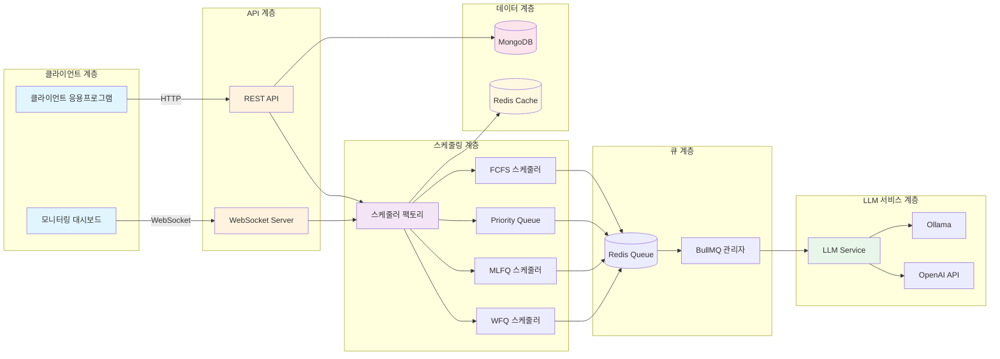
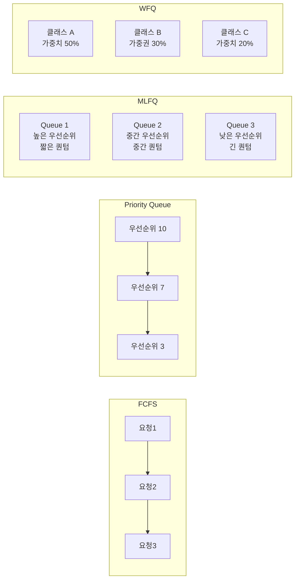
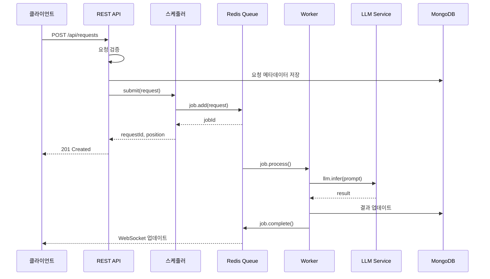
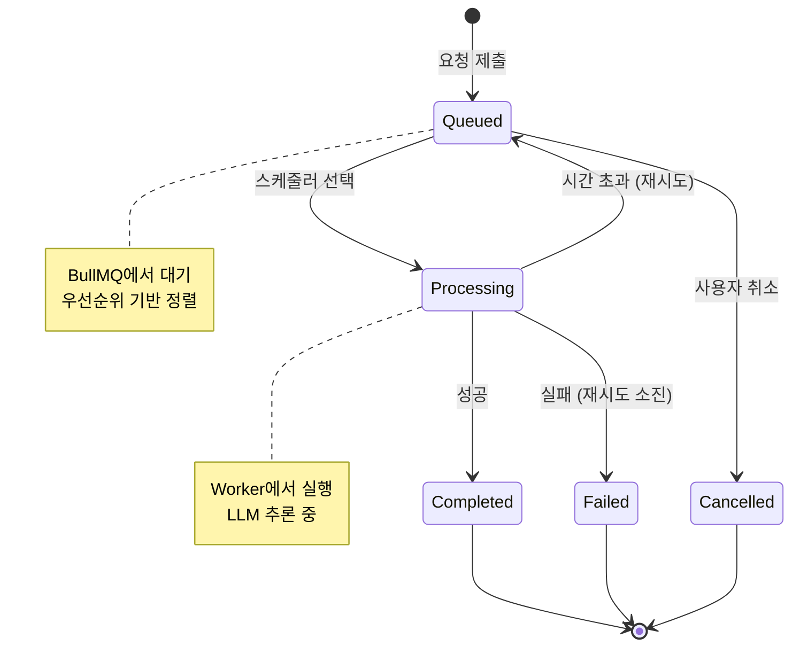
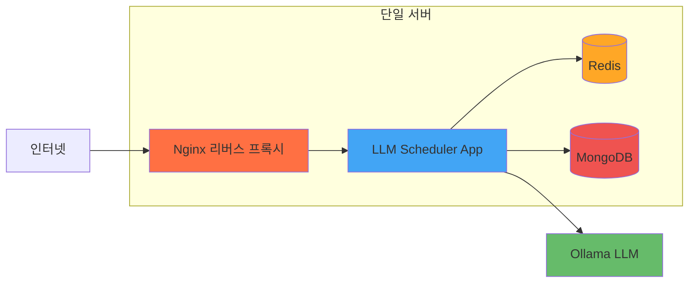
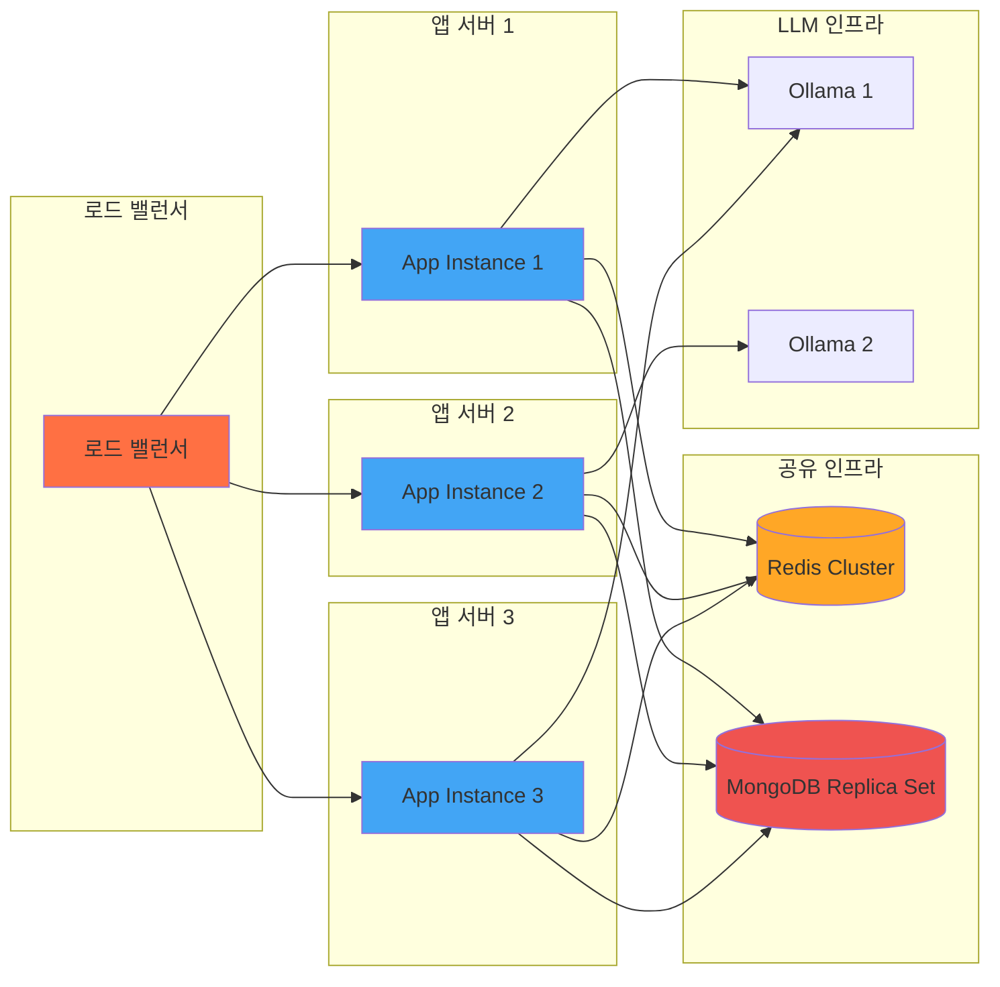

# LLM Scheduler 아키텍처 문서

## 시스템 개요

LLM Scheduler는 운영체제의 프로세스 스케줄링 알고리즘을 LLM API 요청 관리에 적용한 시스템입니다. 대기열 관리, 우선순위 처리, 부하 분산 기능을 제공하여 효율적인 LLM API 호출을 가능하게 합니다.

---

## 1. 시스템 아키텍처

### 1.1 전체 구조



### 1.2 계층별 설명

#### 1.2.1 클라이언트 계층
- **클라이언트 응용프로그램**: LLM 요청을 보내는各类 클라이언트
- **모니터링 대시보드**: 실시간 대기열 상태 및 메트릭 시각화

#### 1.2.2 API 계층
- **REST API**: 요청 제출, 상태 조회, 스케줄러 제어 엔드포인트
- **WebSocket Server**: 실시간 업데이트 및 푸시 알림

#### 1.2.3 스케줄링 계층
- **스케줄러 팩토리**: 알고리즘 선택 및 스케줄러 인스턴스 생성
- **FCFS**: First-Come, First-Served 스케줄링
- **Priority Queue**: 우선순위 기반 스케줄링
- **MLFQ**: Multi-Level Feedback Queue 스케줄링
- **WFQ**: Weighted Fair Queuing 스케줄링

#### 1.2.4 큐 계층
- **Redis Queue**: BullMQ를 위한 Redis 기반 지속형 대기열
- **BullMQ 관리자**: 작업 처리, 재시도, 실패 처리

#### 1.2.5 LLM 서비스 계층
- **LLM Service**: 통합된 LLM 추론 인터페이스
- **Ollama**: 로컬 LLM 추론 지원
- **OpenAI API**: 클라우드 기반 LLM 추론 지원

#### 1.2.6 데이터 계층
- **MongoDB**: 요청 기록, 메트릭, 설정 저장
- **Redis Cache**: 실시간 상태, 세션 정보

---

## 2. 스케줄링 알고리즘

### 2.1 알고리즘 비교



### 2.2 FCFS (First-Come, First-Served)

**특징**:
- 가장 간단한 스케줄링 알고리즘
- 요청 도착 순서대로 처리
- 공폸하지만 긴 요청이 대기시간을 증가시킴

**구현**:
```typescript
class FCFSScheduler implements IScheduler {
  private queue: Queue<QueueJob>;

  async submit(request: LLMRequest): Promise<string> {
    const job = await this.queue.add('process-request', request, {
      jobId: request.id,
      attempts: 3,
      backoff: {
        type: 'exponential',
        delay: 1000,
      },
    });
    return job.id!;
  }
}
```

**장점**:
- 구현이 간단함
- 기아 현상 없음
- 예측 가능한 동작

**단점**:
- 평균 대기시간이 김
- 우선순위 처리 불가능

### 2.3 Priority Queue

**특징**:
- 우선순위가 높은 요청 먼저 처리
- 정적 우선순위 할당
- 기아 현상 가능성

**구현**:
```typescript
class PriorityScheduler implements IScheduler {
  async submit(request: LLMRequest): Promise<string> {
    const priority = this.calculatePriority(request);
    const job = await this.queue.add('process-request', request, {
      priority: priority, // 높은 숫자가 높은 우선순위
      jobId: request.id,
    });
    return job.id!;
  }

  private calculatePriority(request: LLMRequest): number {
    // 사용자 등급, 긴급도, 토큰 예산 고려
    let basePriority = request.priority || 5;
    if (request.userTier === 'premium') {
      basePriority += 3;
    }
    return Math.min(basePriority, 10);
  }
}
```

**장점**:
- 중요한 요청 우선 처리
- 평균 대기시간 개선

**단점**:
- 낮은 우선순위 요청 기아 현상
- 우선순위 결정 복잡도

### 2.4 MLFQ (Multi-Level Feedback Queue)

**특징**:
- 여러 우선순위 큐 사용
- CPU 집중도/대기시간 기반 큐 이동
- 공정성과 응답성 균형

**구현**:
```typescript
class MLFQScheduler implements IScheduler {
  private queues: Map<number, Queue<QueueJob>>;
  private timeQuanta: Map<number, number>;

  constructor(config: MLFQConfig) {
    this.queues = new Map();
    this.timeQuanta = new Map();

    // 여러 큐 초기화
    for (let i = 0; i < config.queueCount; i++) {
      const queue = new Queue(`mlfq-q${i}`, {
        connection: redisConfig,
        defaultJobOptions: {
          attempts: 3,
          backoff: { type: 'exponential', delay: 1000 * (i + 1) },
        },
      });
      this.queues.set(i, queue);
      this.timeQuanta.set(i, config.baseTimeQuantum * (i + 1));
    }
  }

  async submit(request: LLMRequest): Promise<string> {
    const queueIndex = this.determineInitialQueue(request);
    const queue = this.queues.get(queueIndex)!;
    const job = await queue.add('process-request', request);
    return job.id!;
  }

  private determineInitialQueue(request: LLMRequest): number {
    // 짧은 요청은 높은 우선순위 큐로
    if (request.estimatedTokens < 1000) return 0;
    if (request.estimatedTokens < 5000) return 1;
    return 2;
  }
}
```

**큐 이동 규칙**:
1. **승격**: 요청이 시간 퀀텀 내에 완료되면 상위 큐로
2. **강등**: 요청이 시간 퀀텀을 초과하면 하위 큐로
3. **부스팅**: 일정 시간마다 모든 요청을 최상위 큐로

**장점**:
- 공정성과 응답성 균형
- 짧은 요청 빠른 처리
- 기아 현상 최소화

**단점**:
- 구현 복잡도
- 파라미터 튜닝 필요

### 2.5 WFQ (Weighted Fair Queuing)

**특징**:
- 테넌트/클래스별 가중치 할당
- 공정한 대역폭 분배
- 멀티테넌트 환경에 적합

**구현**:
```typescript
class WFQScheduler implements IScheduler {
  private queues: Map<string, Queue<QueueJob>>;
  private weights: Map<string, number>;

  constructor(config: WFQConfig) {
    this.queues = new Map();
    this.weights = new Map();

    // 테넌트별 큐 및 가중치 초기화
    for (const [tenantId, weight] of Object.entries(config.tenantWeights)) {
      const queue = new Queue(`wfq-${tenantId}`, {
        connection: redisConfig,
        limiter: {
          max: weight * 10, // 가중치 비례 처리량
          duration: 1000,
        },
      });
      this.queues.set(tenantId, queue);
      this.weights.set(tenantId, weight);
    }
  }

  async submit(request: LLMRequest): Promise<string> {
    const tenantId = this.extractTenantId(request);
    const queue = this.queues.get(tenantId)!;
    const job = await queue.add('process-request', request);
    return job.id!;
  }

  private extractTenantId(request: LLMRequest): string {
    return request.tenantId || 'default';
  }
}
```

**장점**:
- 공정한 자원 분배
- QoS(서비스 품질) 보장
- 멀티테넌트 최적화

**단점**:
- 복잡한 가중치 계산
- 낮은 가중치 테넌트 성능 저하

---

## 3. 데이터 흐름

### 3.1 요청 처리 흐름



### 3.2 상태 변환



---

## 4. 컴포넌트 상세 설계

### 4.1 도메인 모델

```typescript
// LLM 요청 모델
interface LLMRequest {
  id: string;
  prompt: string;
  maxTokens: number;
  priority: number;
  userId: string;
  tenantId?: string;
  estimatedTokens?: number;
  metadata: Record<string, any>;
  createdAt: Date;
}

// 작업 모델
interface QueueJob extends Job {
  data: LLMRequest;
  attemptsMade: number;
  processedOn?: number;
  finishedOn?: number;
}

// 스케줄러 통계
interface SchedulerStats {
  name: string;
  waiting: number;
  active: number;
  completed: number;
  failed: number;
  delayed: number;
  paused: boolean;
}
```

### 4.2 API 컨트롤러

```typescript
class RequestController {
  constructor(private scheduler: IScheduler) {}

  async submitRequest(req: Request, res: Response) {
    const request = LLMRequestSchema.parse(req.body);

    // 스케줄러에 요청 제출
    const requestId = await this.scheduler.submit(request);

    // 응답 반환
    res.status(201).json({
      success: true,
      requestId,
      status: 'queued',
      position: await this.getQueuePosition(requestId),
      estimatedWaitTime: await this.estimateWaitTime(requestId),
    });
  }

  async getStatus(req: Request, res: Response) {
    const { requestId } = req.params;
    const status = await this.scheduler.getStatus(requestId);
    res.json(status);
  }

  async cancelRequest(req: Request, res: Response) {
    const { requestId } = req.params;
    const cancelled = await this.scheduler.cancel(requestId);
    res.json({ success: cancelled });
  }
}
```

### 4.3 LLM 서비스

```typescript
class LLMService {
  private ollamaClient: OllamaClient;
  private openaiClient: OpenAIClient;

  async infer(request: LLMRequest): Promise<string> {
    // Ollama 우선, 실패 시 OpenAI 폴백
    try {
      return await this.ollamaClient.generate({
        model: 'llama2',
        prompt: request.prompt,
        stream: false,
      });
    } catch (error) {
      console.error('Ollama failed, falling back to OpenAI:', error);
      return await this.openaiClient.completions.create({
        model: 'gpt-3.5-turbo-instruct',
        prompt: request.prompt,
        max_tokens: request.maxTokens,
      });
    }
  }
}
```

### 4.4 메트릭 수집기

```typescript
class MetricsCollector {
  private metrics: Map<string, number[]> = new Map();

  recordWaitTime(requestId: string, waitTime: number): void {
    const key = 'wait_time';
    if (!this.metrics.has(key)) {
      this.metrics.set(key, []);
    }
    this.metrics.get(key)!.push(waitTime);
  }

  getAverageWaitTime(): number {
    const values = this.metrics.get('wait_time') || [];
    return values.reduce((sum, val) => sum + val, 0) / values.length;
  }

  getPercentile(percentile: number): number {
    const values = (this.metrics.get('wait_time') || []).sort((a, b) => a - b);
    const index = Math.ceil(values.length * (percentile / 100)) - 1;
    return values[index] || 0;
  }

  getFairnessMetrics(): {
    giniCoefficient: number;
    starvationRate: number;
  } {
    // 지니 계수 계산 (불평등 지수)
    const values = this.metrics.get('wait_time') || [];
    const n = values.length;
    const sorted = [...values].sort((a, b) => a - b);

    let gini = 0;
    for (let i = 0; i < n; i++) {
      gini += (2 * (i + 1) - n - 1) * sorted[i];
    }
    gini = gini / (n * sorted.reduce((sum, val) => sum + val, 0));

    // 기아율 (평균 대기시간의 2배 이상)
    const avg = this.getAverageWaitTime();
    const starved = values.filter(v => v > avg * 2).length;
    const starvationRate = starved / n;

    return {
      giniCoefficient: Math.abs(gini),
      starvationRate,
    };
  }
}
```

---

## 5. 배포 아키텍처

### 5.1 단일 서버 배포



### 5.2 분산 배포 (스케일아웃)



---

## 6. 성능 최적화

### 6.1 병렬 처리 설정

```typescript
const schedulerConfig = {
  concurrency: {
    fcfs: 2,           // 동시 처리 2개
    priority: 3,       // 동시 처리 3개
    mlfq: 4,           // 동시 처리 4개
    wfq: 5,            // 동시 처리 5개
  },
  queueConfig: {
    maxConcurrent: 10, // 전체 최대 동시 처리
    stalledInterval: 30000, // 30초 후 정체 간주
    maxStalledCount: 1, // 1회 재시도 후 실패 처리
  },
};
```

### 6.2 캐싱 전략

```typescript
class CacheManager {
  private redis: Redis;

  async getCachedResult(prompt: string): Promise<string | null> {
    const cacheKey = this.generateCacheKey(prompt);
    return await this.redis.get(cacheKey);
  }

  async setCachedResult(prompt: string, result: string, ttl: number = 3600): Promise<void> {
    const cacheKey = this.generateCacheKey(prompt);
    await this.redis.setex(cacheKey, ttl, result);
  }

  private generateCacheKey(prompt: string): string {
    // 해시 기반 캐시 키 생성
    return `llm:cache:${crypto.createHash('sha256').update(prompt).digest('hex')}`;
  }
}
```

---

## 7. 모니터링 및 로깅

### 7.1 모니터링 메트릭

| 카테고리 | 메트릭 | 설명 |
|---------|--------|------|
| 대기열 | waiting | 대기 중인 요청 수 |
| 대기열 | active | 활성 요청 수 |
| 대기열 | depth | 대기열 깊이 |
| 성능 | avg_wait_time | 평균 대기시간 |
| 성능 | p95_wait_time | 95번째 백분위수 대기시간 |
| 성능 | throughput | 처리량 (요청/초) |
| 실패 | error_rate | 에러율 |
| 실패 | retry_rate | 재시도율 |

### 7.2 로그 전략

```typescript
class Logger {
  private winston: winston.Logger;

  constructor() {
    this.winston = winston.createLogger({
      level: process.env.LOG_LEVEL || 'info',
      format: winston.format.combine(
        winston.format.timestamp(),
        winston.format.json()
      ),
      transports: [
        new winston.transports.Console(),
        new winston.transports.File({ filename: 'logs/error.log', level: 'error' }),
        new winston.transports.File({ filename: 'logs/combined.log' }),
      ],
    });
  }

  logRequestSubmitted(request: LLMRequest): void {
    this.winston.info('Request submitted', {
      requestId: request.id,
      userId: request.userId,
      priority: request.priority,
      timestamp: new Date().toISOString(),
    });
  }

  logRequestCompleted(requestId: string, duration: number): void {
    this.winston.info('Request completed', {
      requestId,
      duration,
      timestamp: new Date().toISOString(),
    });
  }

  logSchedulerError(error: Error, context: any): void {
    this.winston.error('Scheduler error', {
      error: error.message,
      stack: error.stack,
      context,
      timestamp: new Date().toISOString(),
    });
  }
}
```

---

## 8. 보안 고려사항

### 8.1 API 보안

- **속도 제한**: 분당 100개 요청 제한
- **입력 검증**: Zod 스키마 검증
- **SQL/NoSQL 인젝션 방지**: 매개변수화된 쿼리
- **CORS 설정**: 허용된 출처만 접근

### 8.2 데이터 보안

- **민감 정보 암호화**: API 키, 사용자 데이터
- **접근 제어**: 사용자별 리소스 격리
- **감사 로그**: 모든 API 호출 기록

---

## 9. 확장성 고려사항

### 9.1 수평적 확장

- **Stateless 앱**: 상태를 Redis에 저장하여 앱 인스턴스 추가 가능
- **공유 큐**: Redis Cluster를 사용한 대기열 공유
- **로드 밸런싱**: Nginx 또는 HAProxy를 통한 부하 분산

### 9.2 수직적 확장

- **Worker 프로세스**: CPU 코어 수에 맞춰 Worker 증설
- **메모리**: 대기열 크기 및 캐시 용량 증설
- **네트워크**: 대역폭 확장을 통한 병목 해소

---

## 10. 기술 스택

| 계층 | 기술 | 버전 |
|------|------|------|
| 언어 | TypeScript | 5.9 |
| 런타임 | Node.js | 20 LTS |
| 웹 프레임워크 | Express.js | 4.18 |
| 큐 | BullMQ | 5.0 |
| 캐시 | Redis | 7.2 |
| 데이터베이스 | MongoDB | 7.0 |
| WebSocket | Socket.IO | 4.7 |
| 검증 | Zod | 3.22 |
| 테스트 | Jest | 29.7 |
| LLM | Ollama | Latest |
| API 클라이언트 | OpenAI SDK | 4.x |

---

## 11. 참고 자료

- [BullMQ 문서](https://docs.bullmq.io/)
- [Redis 문서](https://redis.io/docs/)
- [MongoDB 문서](https://docs.mongodb.com/)
- [Express.js 문서](https://expressjs.com/)
- [Socket.IO 문서](https://socket.io/docs/)

---

**문서 버전**: 1.0.0
**최종 업데이트**: 2025-01-25
**유지보수 담당자**: LLM Scheduler 팀
