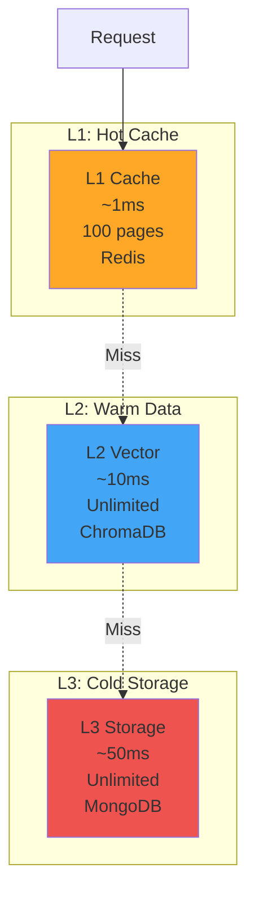
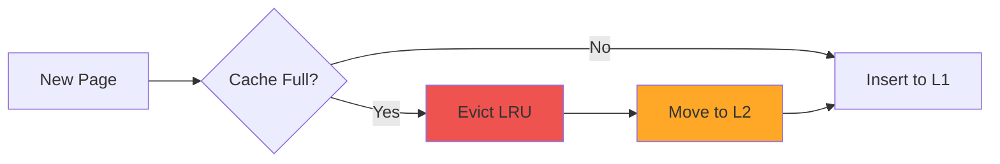

# Memory Manager 사용자 가이드

## 시작하기

이 가이드는 Memory Manager 시스템을 설치, 구성, 사용하는 방법을 안내합니다. Memory Manager는 운영체제의 페이징과 가상 메모리 개념을 AI 에이전트의 컨텍스트 관리에 적용한 시스템입니다.

---

## 1. 설치 (Installation)

### 1.1 사전 요구사항

다음 소프트웨어가 시스템에 설치되어 있어야 합니다.

| 소프트웨어 | 최소 버전 | 권장 버전 | 설치 링크 |
|-----------|----------|----------|----------|
| Node.js | 20.0.0 | 20 LTS | [nodejs.org](https://nodejs.org/) |
| npm | 9.0.0 | 최신 LTS | (Node.js에 포함) |
| Docker | 24.0.0 | 최신 안정 버전 | [docker.com](https://www.docker.com/) |
| Docker Compose | 2.20.0 | 최신 안정 버전 | (Docker Desktop에 포함) |
| Redis | 7.0 | 7.2+ | [redis.io](https://redis.io/) |
| ChromaDB | 0.4.0 | 최신 | [trychroma.com](https://www.trychroma.com/) |
| MongoDB | 7.0 | 최신 | [mongodb.com](https://www.mongodb.com/) |
| Ollama | 최신 | 최신 | [ollama.ai](https://ollama.ai/) |

### 1.2 의존성 서비스 시작

#### Docker Compose 사용 (권장)

```bash
# 프로젝트 디렉토리로 이동
cd candidates/candidate-2-memory-manager

# 모든 서비스 시작
docker-compose up -d

# 서비스 상태 확인
docker-compose ps
```

#### 수동 설치

**Redis 설치**:
```bash
# macOS
brew install redis
brew services start redis

# Ubuntu/Debian
sudo apt-get install redis-server
sudo systemctl start redis

# Windows (WSL2)
sudo apt-get install redis-server
sudo service redis-server start
```

**ChromaDB 설치**:
```bash
# Python pip 필요
pip install chromadb

# ChromaDB 서버 시작
chroma-server --host localhost --port 8000
```

**MongoDB 설치**:
```bash
# macOS
brew tap mongodb/brew
brew install mongodb-community
brew services start mongodb-community

# Ubuntu/Debian
sudo apt-get install mongodb
sudo systemctl start mongodb

# Windows
# MongoDB Community Server 다운로드 및 설치
```

**Ollama 설치**:
```bash
# macOS/Linux
curl https://ollama.ai/install.sh | sh

# 임베딩 모델 다운로드
ollama pull nomic-embed-text

# 모델 목록 확인
ollama list
```

### 1.3 애플리케이션 설치

```bash
# 의존성 설치
npm install

# 환경 변수 설정
cp .env.example .env

# .env 파일 편집
nano .env
```

### 1.4 환경 변수 설정

`.env` 파일을 생성하고 다음 변수를 설정합니다.

```bash
# L1 캐시 (Redis)
REDIS_HOST=localhost
REDIS_PORT=6379
L1_CACHE_SIZE=100          # L1 캐시 용량 (페이지 수)
L1_TTL=300000             # L1 TTL (밀리초) - 기본 5분

# L2 벡터 DB (ChromaDB)
CHROMADB_HOST=localhost
CHROMADB_PORT=8000
CHROMADB_COLLECTION_NAME=memory_vectors

# L3 저장소 (MongoDB)
MONGODB_URI=mongodb://localhost:27017
MONGODB_DB_NAME=memory_manager

# 임베딩 (Ollama)
OLLAMA_BASE_URL=http://localhost:11434
OLLAMA_EMBEDDING_MODEL=nomic-embed-text

# API 서버
PORT=3001
NODE_ENV=development
LOG_LEVEL=info
```

---

## 2. 실행 (Running)

### 2.1 개발 모드

```bash
# 개발 서버 시작 (핫 리로드 지원)
npm run dev

# 또는 TypeScript 직접 실행
npm run dev:ts
```

서버가 `http://localhost:3001`에서 시작됩니다.

### 2.2 프로덕션 모드

```bash
# TypeScript 컴파일
npm run build

# 프로덕션 서버 시작
npm start

# 또는 PM2 사용 (권장)
npm install -g pm2
pm2 start dist/index.js --name memory-manager
pm2 save
pm2 startup
```

### 2.3 헬스 체크

```bash
# 시스템 상태 확인
curl http://localhost:3001/api/health

# 응답 예시
{
  "status": "ok",
  "timestamp": "2025-01-25T10:30:00.000Z",
  "services": {
    "redis": "connected",
    "chromadb": "connected",
    "mongodb": "connected"
  }
}
```

---

## 3. 기본 사용법 (Basic Usage)

### 3.1 값 저장하기 (PUT)

```bash
curl -X POST http://localhost:3001/api/memory/put \
  -H "Content-Type: application/json" \
  -d '{
    "agentId": "agent-001",
    "key": "conversation:123",
    "value": "User asked about the weather in Seoul",
    "metadata": {
      "type": "conversation",
      "timestamp": "2025-01-25T10:30:00.000Z"
    }
  }'
```

**응답**:
```json
{
  "success": true,
  "level": "L1_CACHE",
  "accessTime": 1.2,
  "pageFault": false,
  "message": "Value stored successfully in L1 cache"
}
```

### 3.2 값 조회하기 (GET)

```bash
curl -X POST http://localhost:3001/api/memory/get \
  -H "Content-Type: application/json" \
  -d '{
    "agentId": "agent-001",
    "key": "conversation:123"
  }'
```

**응답**:
```json
{
  "success": true,
  "data": "User asked about the weather in Seoul",
  "level": "L1_CACHE",
  "accessTime": 1.5,
  "pageFault": false,
  "message": "Retrieved from L1 cache"
}
```

### 3.3 의미론적 검색 (Semantic Search)

```bash
curl -X POST http://localhost:3001/api/memory/search \
  -H "Content-Type: application/json" \
  -d '{
    "agentId": "agent-001",
    "query": "weather discussion",
    "topK": 5,
    "threshold": 0.7
  }'
```

**응답**:
```json
{
  "success": true,
  "results": [
    {
      "key": "conversation:123",
      "value": "User asked about the weather in Seoul",
      "similarity": 0.89,
      "level": "L2_VECTOR"
    },
    {
      "key": "conversation:456",
      "value": "Discussed temperature and humidity",
      "similarity": 0.76,
      "level": "L2_VECTOR"
    }
  ],
  "accessTime": 18.5
}
```

### 3.4 통계 확인

```bash
curl http://localhost:3001/api/stats
```

**응답**:
```json
{
  "l1Size": 45,
  "l1Capacity": 100,
  "l2Size": 234,
  "l3Size": 1523,
  "totalAccesses": 5432,
  "pageFaults": 108,
  "hitRate": 0.85,
  "averageAccessTime": 8.5,
  "evictions": 234,
  "promotions": 45,
  "demotions": 123
}
```

---

## 4. 메모리 계층 이해하기 (Understanding Memory Tiers)

### 4.1 3계층 아키텍처



### 4.2 L1 캐시 (Redis)

**특징**:
- **속도**: 가장 빠름 (~1ms)
- **용량**: 제한됨 (기본 100페이지)
- **용도**: 자주 접근하는 데이터 (Hot Data)
- **TTL**: 기본 5분 후 만료

**사용 케이스**:
- 사용자 세션 데이터
- 자주 참조하는 설정
- 실시간으로 필요한 컨텍스트

### 4.3 L2 벡터 DB (ChromaDB)

**특징**:
- **속도**: 중간 (~10ms)
- **용량**: 무제한
- **용도**: 의미론적 검색이 가능한 데이터 (Warm Data)
- **임베딩**: 자동 생성

**사용 케이스**:
- 대화 기록
- 문서 검색
- 유사한 컨텍스트 찾기

### 4.4 L3 저장소 (MongoDB)

**특징**:
- **속도**: 가장 느림 (~50ms)
- **용량**: 무제한
- **용도**: 영구 저장 (Cold Data)
- **Page Fault**: L3 접근 시 발생

**사용 케이스**:
- 오래된 대화 기록
- 찾기 힘든 데이터
- 백업 및 감사 로그

---

## 5. 고급 사용법 (Advanced Usage)

### 5.1 클라이언트 라이브러리

**Node.js 클라이언트**:
```javascript
const { MemoryManagerClient } = require('@memory-manager/client');

const client = new MemoryManagerClient({
  baseURL: 'http://localhost:3001/api'
});

async function example() {
  // 값 저장
  await client.put('agent-001', 'key', 'value', { type: 'test' });

  // 값 조회
  const result = await client.get('agent-001', 'key');
  console.log(result.data);

  // 의미론적 검색
  const searchResults = await client.search('agent-001', 'test query');
  console.log(searchResults.results);

  // 통계
  const stats = await client.getStats();
  console.log('Hit rate:', stats.hitRate);
}

example();
```

**Python 클라이언트**:
```python
from memory_manager import MemoryManagerClient

client = MemoryManagerClient(base_url="http://localhost:3001/api")

# 값 저장
client.put("agent-001", "key", "value", {"type": "test"})

# 값 조회
result = client.get("agent-001", "key")
print(result.data)

# 의미론적 검색
results = client.search("agent-001", "test query")
print(results.results)

# 통계
stats = client.get_stats()
print(f"Hit rate: {stats.hit_rate}")
```

### 5.2 배치 연산

```javascript
// 여러 값 한 번에 저장
async function batchPut(agentId, items) {
  const promises = items.map(item =>
    client.put(agentId, item.key, item.value, item.metadata)
  );
  await Promise.all(promises);
}

// 여러 값 한 번에 조회
async function batchGet(agentId, keys) {
  const promises = keys.map(key =>
    client.get(agentId, key)
  );
  return await Promise.all(promises);
}
```

### 5.3 캐시 워밍

자주 사용되는 데이터를 미리 L1에 로드:

```javascript
async function warmCache(agentId) {
  const hotKeys = [
    'config',
    'user:profile',
    'session:data'
  ];

  for (const key of hotKeys) {
    await client.get(agentId, key);
  }

  console.log('Cache warmed successfully');
}
```

---

## 6. OS 개념 이해하기 (Understanding OS Concepts)

### 6.1 페이징 (Paging)

Memory Manager는 운영체제의 페이징 개념을 에이전트 컨텍스트에 적용합니다.

**페이지 (Page)**:
- 메모리의 기본 단위
- 각 페이지는 고유한 키로 식별
- 크기는 가변 (JSON 직렬화 크기)

**페이지 테이블 (Page Table)**:
- 논리 주소(agentId:key)를 물리 주소(Redis/ChromaDB/MongoDB)로 매핑
- 페이지의 현재 위치 추적
- 접근 권한 관리

### 6.2 LRU 교체 정책

가장 오랫동안 사용되지 않은 페이지를 먼저 교체합니다.



### 6.3 페이지 부족 (Page Fault)

요청한 데이터가 L1, L2에 없고 L3에만 있을 때 발생합니다.

**페이지 부족 해결 과정**:
1. L3에서 데이터 조회
2. 임베딩 생성
3. L2에 저장 (벡터와 함께)
4. L1에 승격
5. 데이터 반환

---

## 7. 성능 최적화 (Performance Optimization)

### 7.1 캐시 히트율 높이기

**전략 1: 자주 사용하는 데이터 패턴 파악**
```javascript
// 액세스 패턴 분석
const accessLog = await analyzeAccessPatterns('agent-001');
const hotKeys = accessLog.filter(item => item.count > 10).map(item => item.key);

// 핫 데이터를 L1에 유지
for (const key of hotKeys) {
  await client.get('agent-001', key);
}
```

**전략 2: 적절한 TTL 설정**
```javascript
// 자주 변경되는 데이터: 짧은 TTL
await client.put('agent-001', 'session', data, { ttl: 60000 }); // 1분

// 드물게 변경되는 데이터: 긴 TTL
await client.put('agent-001', 'config', data, { ttl: 3600000 }); // 1시간
```

### 7.2 의미론적 검색 최적화

**topK 조정**:
```javascript
// 정확도보다는 속도가 중요한 경우
const results = await client.search('agent-001', 'query', {
  topK: 3,      // 상위 3개만
  threshold: 0.8  // 높은 유사도
});

// 재현율보다는 속도가 중요한 경우
const results = await client.search('agent-001', 'query', {
  topK: 10,     // 많은 결과
  threshold: 0.5  // 낮은 유사도
});
```

### 7.3 배치 처리

```javascript
// 여러 연산을 병렬로 처리
async function parallelOperations(agentId) {
  const [data1, data2, data3] = await Promise.all([
    client.get(agentId, 'key1'),
    client.get(agentId, 'key2'),
    client.get(agentId, 'key3')
  ]);

  return { data1, data2, data3 };
}
```

---

## 8. 모니터링 및 디버깅 (Monitoring & Debugging)

### 8.1 메트릭 모니터링

**핵심 메트릭**:
- **hitRate**: 캐시 적중률 (목표: > 80%)
- **averageAccessTime**: 평균 접근 시간 (목표: < 10ms)
- **pageFaultRate**: 페이지 부족률 (목표: < 20%)

**메트릭 조회**:
```bash
curl http://localhost:3001/api/stats | jq '.hitRate, .averageAccessTime, .pageFaults'
```

### 8.2 로그 확인

```bash
# 개발 모드: 상세 로그
LOG_LEVEL=debug npm run dev

# 프로덕션 모드: 에러만
LOG_LEVEL=error npm start
```

### 8.3 디버깅 팁

**문제: 캐시 적중률이 낮음**

해결:
```javascript
// 1. 액세스 패턴 분석
const stats = await client.getStats();
console.log('Hit rate:', stats.hitRate);
console.log('Page faults:', stats.pageFaults);

// 2. L1 용량 증설
// .env에서 L1_CACHE_SIZE=200

// 3. TTL 조정
// 자주 변경되지 않는 데이터에 긴 TTL 부여
```

**문제: 의미론적 검색 결과가 부정확**

해결:
```javascript
// 1. threshold 조정
const results = await client.search('agent-001', 'query', {
  threshold: 0.7  // 더 높은 유사도 요구
});

// 2. 임베딩 모델 변경
// 더 큰 모델 사용 (nomic-embed-text-v1.5)
```

---

## 9. 문제 해결 (Troubleshooting)

### 9.1 일반적인 문제

**문제**: 서버가 시작되지 않음

```bash
# 포트 충돌 확인
lsof -i :3001

# 다른 포트 사용
PORT=3002 npm run dev
```

**문제**: Redis 연결 실패

```bash
# Redis 상태 확인
redis-cli ping

# Redis 시작
brew services start redis  # macOS
sudo systemctl start redis  # Linux
```

**문제**: ChromaDB 연결 실패

```bash
# ChromaDB 상태 확인
curl http://localhost:8000/api/v1/heartbeat

# ChromaDB 시작
chroma-server --host localhost --port 8000
```

**문제**: MongoDB 연결 실패

```bash
# MongoDB 상태 확인
mongosh --eval "db.adminCommand('ping')"

# MongoDB 시작
brew services start mongodb-community  # macOS
sudo systemctl start mongodb  # Linux
```

**문제**: Ollama 연결 실패

```bash
# Ollama 상태 확인
curl http://localhost:11434/api/tags

# Ollama 시작
ollama serve

# 모델 확인
ollama list
ollama pull nomic-embed-text
```

### 9.2 진단 도구

```bash
# 전체 시스템 헬스 체크
curl http://localhost:3001/api/health

# 통계 확인
curl http://localhost:3001/api/stats | jq '.'

# Redis 모니터링
redis-cli monitor

# MongoDB 로그
mongosh
> use memory_manager
> db.memorypages.find().pretty()

# ChromaDB 컬렉션 확인
curl http://localhost:8000/api/v1/collections
```

---

## 10. 모범 사례 (Best Practices)

### 10.1 키 설계

**좋은 예시**:
```javascript
// 명확하고 구조화된 키
'conversation:2025-01-25:user-123'
'user:profile:user-123'
'session:active:abc123'

// 계층적 구조
'agent:agent-001:conversation:msg-456'
'agent:agent-001:context:current'
```

**나쁜 예시**:
```javascript
// 모호한 키
'data'
'item'
'value'

// 너무 긴 키
'very:long:key:name:that:is:hard:to:read:and:manage:123456789'
```

### 10.2 값 직렬화

**JSON 직렬화**:
```javascript
// 복잡한 객체는 JSON으로 직렬화
const complexData = {
  messages: [
    { role: 'user', content: 'Hello' },
    { role: 'assistant', content: 'Hi there!' }
  ],
  metadata: {
    timestamp: Date.now(),
    version: '1.0'
  }
};

await client.put('agent-001', 'conversation', JSON.stringify(complexData));

// 조회 후 역직렬화
const retrieved = await client.get('agent-001', 'conversation');
const data = JSON.parse(retrieved.data);
```

### 10.3 에러 처리

```javascript
try {
  const result = await client.get('agent-001', 'key');
  console.log(result.data);
} catch (error) {
  if (error.code === 'KEY_NOT_FOUND') {
    console.log('Key not found, using default value');
  } else if (error.code === 'L1_CACHE_FULL') {
    console.log('Cache full, consider increasing capacity');
  } else {
    console.error('Unexpected error:', error);
  }
}
```

---

## 11. 다음 단계 (Next Steps)

- **[API 문서](./API.md)** - 전체 API 레퍼런스
- **[아키텍처 문서](./ARCHITECTURE.md)** - 시스템 설계 및 컴포넌트 상세
- **[테스트 가이드](../tests/)** - 테스트 작성 및 실행
- **[GitHub 저장소](https://github.com/your-repo)** - 소스 코드

---

## 12. 지원 및 피드백 (Support & Feedback)

- **이메일**: support@memory-manager.dev
- **Discord**: [커뮤니티 서버](https://discord.gg/memory-manager)
- **GitHub Issues**: [버그 보고](https://github.com/your-repo/issues)

---

## 13. 라이선스 (License)

이 프로젝트는 [MIT 라이선스](../LICENSE) 하에 배포됩니다.

---

**문서 버전**: 1.0.0
**최종 업데이트**: 2025-01-25
**유지보수 담당자**: Memory Manager 팀
