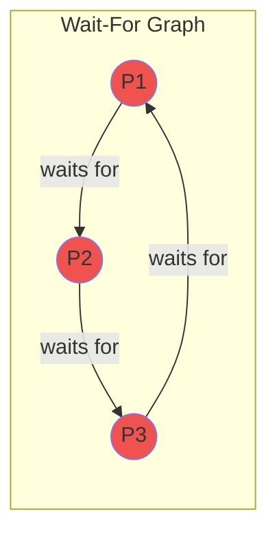
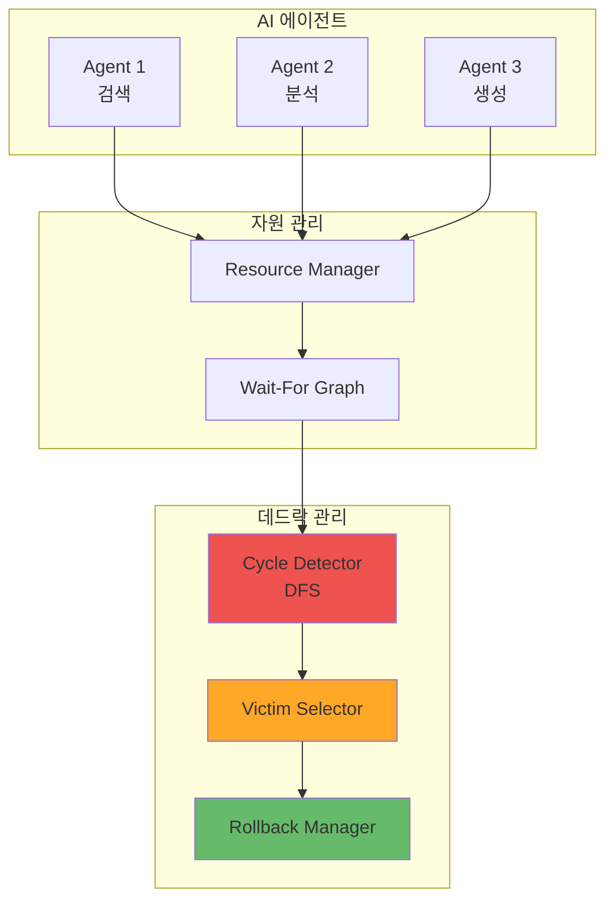

# Deadlock Detector 학습 가이드

**버전:** 1.0.0
**작성일:** 2026-01-25
**대상 독자:** 운영체제를 학습하는 학생, AI 시스템 개발자

---

## 목차

1. [OS 데드락 개념 설명](#1-os-데드락-개념-설명)
2. [멀티 에이전트 시스템 적용](#2-멀티-에이전트-시스템-적용)
3. [실습 예제](#3-실습-예제)
4. [연습 문제](#4-연습-문제)

---

## 1. OS 데드락 개념 설명

### 1.1 데드락이란?

**데드락(Deadlock, 교착 상태)**은 두 개 이상의 프로세스가 서로가 가진 자원을 기다리며 영원히 대기하는 상태입니다.

#### 일상생활 예시: 좁은 골목

```
      ← 차량 A
   ┌─────────────┐
   │             │
───┤   좁은 골목  ├───
   │             │
   └─────────────┘
      차량 B →

두 차량이 동시에 골목에 진입하면:
- 차량 A는 차량 B가 빠지길 기다림
- 차량 B는 차량 A가 빠지길 기다림
→ 영원히 대기 (데드락!)
```

#### 컴퓨터 시스템 예시

```
프로세스 A: 프린터를 보유, 스캐너를 대기
프로세스 B: 스캐너를 보유, 프린터를 대기

A → (waits for Scanner) → B
B → (waits for Printer) → A

순환 대기 발생 → 데드락!
```

### 1.2 데드락의 4가지 필요조건

데드락이 발생하려면 다음 **네 가지 조건이 동시에** 만족되어야 합니다.

#### 조건 1: 상호 배제 (Mutual Exclusion)

```
정의: 자원은 한 번에 하나의 프로세스만 사용할 수 있다.

예시:
- 프린터: 한 문서만 인쇄 가능
- 파일 쓰기 잠금: 한 프로세스만 쓰기 가능
- GPU: 한 작업만 실행 가능
```

#### 조건 2: 점유 대기 (Hold and Wait)

```
정의: 프로세스가 자원을 보유한 상태에서 다른 자원을 요청한다.

예시:
프로세스 P1:
  1. 파일 A 열기 (보유)
  2. 파일 B 열기 요청 (대기)
  
→ A를 놓지 않고 B를 기다림
```

#### 조건 3: 비선점 (No Preemption)

```
정의: 프로세스가 자원을 자발적으로 놓을 때까지 빼앗을 수 없다.

예시:
- 프린터 작업 중 강제 종료 불가
- 파일 쓰기 중 강제 잠금 해제 불가
- DB 트랜잭션 중 강제 롤백 불가
```

#### 조건 4: 순환 대기 (Circular Wait)

```
정의: 프로세스들이 원형으로 서로의 자원을 기다린다.

예시:
P1 → P2 → P3 → P1

P1이 P2의 자원을 기다림
P2가 P3의 자원을 기다림
P3가 P1의 자원을 기다림
```

### 1.3 Wait-For Graph

Wait-For Graph(WFG)는 프로세스 간의 대기 관계를 그래프로 표현합니다.



**핵심 원리:**
- 노드 = 프로세스
- 엣지 = 대기 관계 (A→B: A가 B의 자원을 기다림)
- **사이클 = 데드락**

### 1.4 데드락 탐지: DFS 알고리즘

그래프에서 사이클을 찾기 위해 깊이 우선 탐색(DFS)을 사용합니다.

```
알고리즘: 사이클 탐지

1. 모든 노드를 '미방문'으로 표시
2. 각 미방문 노드에서 DFS 시작:
   a. 현재 노드를 '방문 중'으로 표시
   b. 이웃 노드 확인:
      - '방문 중' → 사이클 발견! (데드락)
      - '미방문' → 재귀적으로 DFS
      - '방문 완료' → 건너뜀
   c. 현재 노드를 '방문 완료'로 표시
3. 발견된 모든 사이클 반환
```

### 1.5 데드락 해결 방법

| 방법 | 설명 | 장점 | 단점 |
|------|------|------|------|
| **예방** | 4가지 조건 중 하나 제거 | 데드락 원천 차단 | 자원 낭비 |
| **회피** | 안전 상태만 유지 | 높은 활용도 | 복잡함 |
| **탐지** | 발생 후 감지/해결 | 최대 활용도 | 복구 비용 |
| **무시** | 데드락 무시 | 단순함 | 시스템 장애 |

---

## 2. 멀티 에이전트 시스템 적용

### 2.1 AI 에이전트 시스템이란?

AI 에이전트는 특정 목표를 달성하기 위해 자율적으로 행동하는 소프트웨어 프로그램입니다.

```
┌─────────────────────────────────────────────────┐
│              멀티 에이전트 시스템                 │
├─────────────────────────────────────────────────┤
│  ┌─────────┐  ┌─────────┐  ┌─────────┐         │
│  │Agent 1  │  │Agent 2  │  │Agent 3  │  ...    │
│  │(검색)   │  │(분석)   │  │(생성)   │         │
│  └────┬────┘  └────┬────┘  └────┬────┘         │
│       │            │            │               │
│       ▼            ▼            ▼               │
│  ┌─────────────────────────────────────────┐   │
│  │           공유 자원 풀                    │   │
│  │  [GPU] [메모리] [API] [데이터베이스]      │   │
│  └─────────────────────────────────────────┘   │
└─────────────────────────────────────────────────┘
```

### 2.2 OS 개념의 AI 시스템 매핑

| OS 개념 | AI 에이전트 시스템 | 예시 |
|---------|------------------|------|
| 프로세스 | AI 에이전트 | 검색 에이전트, 분석 에이전트 |
| 공유 자원 | GPU, API, 메모리 | NVIDIA GPU, OpenAI API |
| 자원 요청 | 에이전트 요청 | GPU 할당 요청 |
| 자원 해제 | 작업 완료 | 추론 완료 후 GPU 반환 |
| 데드락 | 에이전트 교착 | 상호 대기 상태 |

### 2.3 AI 에이전트 데드락 시나리오

#### 시나리오 1: GPU 경쟁

```
Agent-1 (이미지 분석):
  - GPU-A 보유
  - 대용량 메모리 대기

Agent-2 (영상 처리):
  - 대용량 메모리 보유
  - GPU-A 대기

결과:
Agent-1 → (waits for Memory) → Agent-2 → (waits for GPU-A) → Agent-1
데드락 발생!
```

#### 시나리오 2: API 제한

```
Agent-1 (데이터 수집):
  - OpenAI API 슬롯 보유
  - Google API 슬롯 대기

Agent-2 (데이터 검증):
  - Google API 슬롯 보유
  - OpenAI API 슬롯 대기

결과: 순환 대기 → 데드락!
```

### 2.4 시스템 아키텍처



---

## 3. 실습 예제

### 3.1 환경 설정

```bash
# 1. 프로젝트 클론
cd candidates/candidate-3-deadlock-detector

# 2. 의존성 설치
npm install

# 3. 개발 서버 실행
npm run dev

# 서버 주소: http://localhost:3003
```

### 3.2 실습 1: 에이전트와 자원 생성

```bash
# 에이전트 3개 생성
curl -X POST http://localhost:3003/api/agents \
  -H "Content-Type: application/json" \
  -d '{"name": "Agent-1", "priority": 5}'

curl -X POST http://localhost:3003/api/agents \
  -H "Content-Type: application/json" \
  -d '{"name": "Agent-2", "priority": 3}'

curl -X POST http://localhost:3003/api/agents \
  -H "Content-Type: application/json" \
  -d '{"name": "Agent-3", "priority": 7}'

# 자원 3개 생성
curl -X POST http://localhost:3003/api/resources \
  -H "Content-Type: application/json" \
  -d '{"name": "GPU-1", "type": "computational"}'

curl -X POST http://localhost:3003/api/resources \
  -H "Content-Type: application/json" \
  -d '{"name": "Memory-1", "type": "memory"}'

curl -X POST http://localhost:3003/api/resources \
  -H "Content-Type: application/json" \
  -d '{"name": "API-1", "type": "network"}'
```

### 3.3 실습 2: 데드락 시나리오 생성

```bash
# 시나리오: 순환 대기 생성
# 1. Agent-1이 GPU-1 보유
curl -X POST http://localhost:3003/api/resources/request \
  -H "Content-Type: application/json" \
  -d '{"agentId": "agent-1-id", "resourceId": "gpu-1-id"}'

# 2. Agent-2가 Memory-1 보유
curl -X POST http://localhost:3003/api/resources/request \
  -H "Content-Type: application/json" \
  -d '{"agentId": "agent-2-id", "resourceId": "memory-1-id"}'

# 3. Agent-3가 API-1 보유
curl -X POST http://localhost:3003/api/resources/request \
  -H "Content-Type: application/json" \
  -d '{"agentId": "agent-3-id", "resourceId": "api-1-id"}'

# 4. 순환 대기 생성
# Agent-1 → Memory-1 (Agent-2가 보유)
# Agent-2 → API-1 (Agent-3가 보유)
# Agent-3 → GPU-1 (Agent-1이 보유)
```

### 3.4 실습 3: 데드락 탐지

```bash
# 데드락 탐지 실행
curl -X POST http://localhost:3003/api/deadlock/detect

# 응답 예시:
# {
#   "hasDeadlock": true,
#   "cycles": [{
#     "cycleId": "cycle-abc123",
#     "agents": ["agent-1-id", "agent-2-id", "agent-3-id"],
#     "detectedAt": "2026-01-25T10:30:00.000Z"
#   }]
# }
```

### 3.5 실습 4: 희생자 선택 및 회복

```bash
# 희생자 선택 (우선순위 기반)
curl -X POST http://localhost:3003/api/deadlock/victim \
  -H "Content-Type: application/json" \
  -d '{
    "cycleId": "cycle-abc123",
    "strategy": "lowest_priority"
  }'

# 응답 예시:
# {
#   "victim": {
#     "agentId": "agent-2-id",
#     "name": "Agent-2",
#     "priority": 3
#   },
#   "reason": "Lowest priority (3) among 3 agents"
# }

# 롤백 실행
curl -X POST http://localhost:3003/api/recovery/rollback/agent-2-id
```

### 3.6 실습 5: 은행원 알고리즘

```bash
# 현재 안전 상태 확인
curl http://localhost:3003/api/bankers

# 응답 예시:
# {
#   "isSafe": true,
#   "safeSequence": ["agent-1-id", "agent-3-id", "agent-2-id"],
#   "availableResources": {"gpu-1": 0, "memory-1": 1, "api-1": 0}
# }

# 안전하지 않은 요청 테스트
curl -X POST http://localhost:3003/api/bankers/request \
  -H "Content-Type: application/json" \
  -d '{
    "agentId": "agent-1-id",
    "requests": {"memory-1": 2, "api-1": 1}
  }'

# 응답: 요청 거부 (안전하지 않은 상태)
```

---

## 4. 연습 문제

### 문제 1: 데드락 조건 식별

다음 시나리오에서 데드락 4가지 조건을 식별하세요:

```
시나리오:
- Agent-A가 DB 연결 1을 보유하고 DB 연결 2를 요청
- Agent-B가 DB 연결 2를 보유하고 DB 연결 1을 요청
- DB 연결은 한 에이전트만 사용 가능
- 연결은 에이전트가 명시적으로 해제해야 함
```

**질문:**
1. 상호 배제 조건은 무엇인가요?
2. 점유 대기 조건은 무엇인가요?
3. 비선점 조건은 무엇인가요?
4. 순환 대기 조건은 무엇인가요?

<details>
<summary>정답 보기</summary>

1. **상호 배제:** DB 연결은 한 에이전트만 사용 가능
2. **점유 대기:** Agent-A가 DB1을 보유하면서 DB2를 요청
3. **비선점:** 에이전트가 명시적으로 해제해야 함
4. **순환 대기:** A→B→A 순환 구조

</details>

### 문제 2: Wait-For Graph 그리기

다음 상황을 Wait-For Graph로 그리세요:

```
- Agent-1이 Resource-A를 보유, Resource-B를 대기
- Agent-2가 Resource-B를 보유, Resource-C를 대기
- Agent-3가 Resource-C를 보유, Resource-A를 대기
```

**질문:**
1. 그래프를 그리세요.
2. 사이클이 있나요? 있다면 경로는?
3. 데드락이 발생했나요?

<details>
<summary>정답 보기</summary>

1. 그래프:
```
Agent-1 → Agent-2 → Agent-3 → Agent-1
```

2. 사이클 존재: Agent-1 → Agent-2 → Agent-3 → Agent-1

3. 예, 데드락이 발생했습니다.

</details>

### 문제 3: 희생자 선택

다음 사이클에서 각 전략별 희생자를 선택하세요:

```
사이클 에이전트:
- Agent-A: priority=8, 생성 1시간 전, 자원 3개 보유
- Agent-B: priority=2, 생성 30분 전, 자원 1개 보유
- Agent-C: priority=5, 생성 2시간 전, 자원 2개 보유
```

**질문:**
1. Lowest Priority 전략의 희생자는?
2. Youngest 전략의 희생자는?
3. Most Resources 전략의 희생자는?

<details>
<summary>정답 보기</summary>

1. **Lowest Priority:** Agent-B (priority=2)
2. **Youngest:** Agent-B (30분, 가장 최근)
3. **Most Resources:** Agent-A (3개)

</details>

### 문제 4: 은행원 알고리즘

다음 상태에서 안전 순서를 구하세요:

```
자원: [Resource-1: 총 3개, Resource-2: 총 2개]
가용: [Resource-1: 1개, Resource-2: 1개]

에이전트별 할당/최대:
- Agent-A: 할당 [1, 0], 최대 [2, 1]
- Agent-B: 할당 [1, 1], 최대 [2, 2]
- Agent-C: 할당 [0, 0], 최대 [1, 1]
```

**질문:**
1. 각 에이전트의 Need(필요량)를 계산하세요.
2. 안전 순서를 구하세요.
3. 이 상태는 안전한가요?

<details>
<summary>정답 보기</summary>

1. Need 계산:
   - Agent-A: [2-1, 1-0] = [1, 1]
   - Agent-B: [2-1, 2-1] = [1, 1]
   - Agent-C: [1-0, 1-0] = [1, 1]

2. 안전 순서 탐색:
   - 가용 [1, 1]
   - Agent-C: Need [1,1] <= Work [1,1] ✓ → Work = [1,1]
   - Agent-A: Need [1,1] <= Work [1,1] ✓ → Work = [2,1]
   - Agent-B: Need [1,1] <= Work [2,1] ✓ → Work = [3,2]
   
   안전 순서: [Agent-C, Agent-A, Agent-B]

3. 예, 안전한 상태입니다.

</details>

### 문제 5: 코드 분석

다음 CycleDetector 코드의 시간 복잡도를 분석하세요:

```typescript
public detect(): DeadlockCycle[] {
  for (const agentId of this.graph.agents.keys()) {
    if (node.state === NodeState.UNVISITED) {
      this.dfsVisit(agentId);
    }
  }
  return this.cycles;
}

private dfsVisit(agentId: string): void {
  const outgoingEdges = this.getOutgoingEdges(agentId);
  for (const edge of outgoingEdges) {
    // ... 처리
    if (neighbor.state === NodeState.UNVISITED) {
      this.dfsVisit(neighborId);
    }
  }
}
```

**질문:**
1. 외부 for 루프의 복잡도는?
2. dfsVisit의 복잡도는?
3. 전체 알고리즘의 시간 복잡도는?

<details>
<summary>정답 보기</summary>

1. 외부 루프: O(V) - 모든 노드 순회
2. dfsVisit: O(E/V) 평균 - 각 노드의 이웃 탐색
3. 전체: **O(V + E)** - 각 노드와 엣지를 최대 한 번씩 방문

</details>

---

## 참고 자료

### 필수 읽기
- 운영체제 교재: "Operating System Concepts" (Silberschatz)
- 그래프 알고리즘: "Introduction to Algorithms" (CLRS)

### 추가 학습
- [MIT OCW - Operating Systems](https://ocw.mit.edu/courses/6-828-operating-system-engineering-fall-2012/)
- [Banker's Algorithm Visualization](https://www.cs.uic.edu/~jbell/CourseNotes/OperatingSystems/7_Deadlocks.html)

---

**문서 버전:** 1.0.0
**최종 수정:** 2026-01-25
**작성자:** 홍익대학교 컴퓨터공학과 졸업 프로젝트 팀
