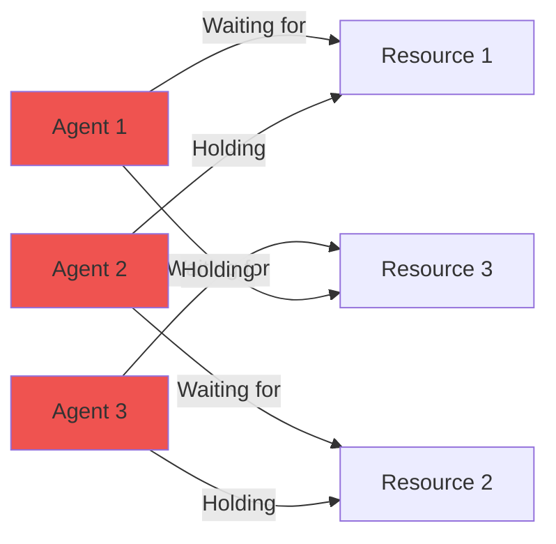

# Deadlock Detector 사용자 가이드

## 시작하기

이 가이드는 Deadlock Detector 시스템을 설치, 구성, 사용하는 방법을 안내합니다. Deadlock Detector는 운영체제의 데드락 감지 및 회복 알고리즘을 AI/LLM 다중 에이전트 시스템에 적용한 시스템입니다.

---

## 1. 설치 (Installation)

### 1.1 사전 요구사항

| 소프트웨어 | 최소 버전 | 권장 버전 |
|-----------|----------|----------|
| Node.js | 20.0.0 | 20 LTS |
| npm | 9.0.0 | 최신 LTS |
| MongoDB | 7.0 | 최신 |
| Redis | 7.0 | 7.2+ |

### 1.2 의존성 서비스 시작

```bash
# MongoDB 시작
mongod --dbpath ./data

# Redis 시작
redis-server

# 또는 Docker 사용
docker run -d -p 27017:27017 --name mongodb mongo:7.0
docker run -d -p 6379:6379 --name redis redis:7.2
```

### 1.3 애플리케이션 설치

```bash
# 프로젝트 디렉토리로 이동
cd candidates/candidate-3-deadlock-detector

# 의존성 설치
npm install

# 환경 변수 설정
cp .env.example .env
```

### 1.4 환경 변수 설정

```bash
# .env 파일
MONGODB_URI=mongodb://localhost:27017/deadlock-detector
REDIS_HOST=localhost
REDIS_PORT=6379
PORT=3003
NODE_ENV=development
```

---

## 2. 실행 (Running)

### 2.1 개발 모드

```bash
npm run dev
```

서버가 `http://localhost:3003`에서 시작됩니다.

### 2.2 프로덕션 모드

```bash
npm run build
npm start
```

---

## 3. 기본 사용법 (Basic Usage)

### 3.1 에이전트 및 자원 생성

```bash
# 에이전트 생성
curl -X POST http://localhost:3003/api/agents \
  -H "Content-Type: application/json" \
  -d '{
    "name": "Worker-1",
    "priority": 5
  }'

# 자원 생성
curl -X POST http://localhost:3003/api/resources \
  -H "Content-Type: application/json" \
  -d '{
    "name": "GPU-1",
    "type": "computational",
    "instances": 1
  }'
```

### 3.2 자원 요청 및 할당

```bash
# 자원 요청
curl -X POST http://localhost:3003/api/resources/request \
  -H "Content-Type: application/json" \
  -d '{
    "agentId": "agent-1",
    "resourceId": "res-1"
  }'

# 자원 해제
curl -X POST http://localhost:3003/api/resources/release \
  -H "Content-Type: application/json" \
  -d '{
    "agentId": "agent-1",
    "resourceId": "res-1"
  }'
```

### 3.3 데드락 감지

```bash
# 데드락 감지
curl -X POST http://localhost:3003/api/deadlock/detect
```

### 3.4 희생자 선택

```bash
# 희생자 선택
curl -X POST http://localhost:3003/api/deadlock/victim \
  -H "Content-Type: application/json" \
  -d '{
    "cycleId": "cycle-1",
    "strategy": "lowest_priority"
  }'
```

---

## 4. 데드락 시나리오 (Deadlock Scenarios)

### 4.1 순환 대기 (Circular Wait)



### 4.2 데드락 해결 프로세스

1. **감지**: Wait-For Graph에서 사이클 탐지
2. **분석**: 사이클에 포함된 에이전트와 자원 식별
3. **선택**: 희생자 선택 전략 적용
4. **체크포인트**: 희생자 상태 저장
5. **롤백**: 희생자 종료 및 자원 해제
6. **복구**: 저장된 상태에서 에이전트 재시작

---

## 5. WebSocket 실시간 모니터링

### 5.1 연결 및 구독

```javascript
const io = require('socket.io-client');
const socket = io('http://localhost:3003');

// 그래프 업데이트 구독
socket.emit('subscribe:graph');

// 데드락 알림 구독
socket.emit('subscribe:deadlock');

// 그래프 업데이트 수신
socket.on('graph-updated', (data) => {
  console.log('Graph updated:', data);
  updateGraphVisualization(data);
});

// 데드락 감지 알림
socket.on('deadlock-detected', (data) => {
  console.log('Deadlock detected:', data);
  alertDeadlock(data);
});
```

---

## 6. 문제 해결 (Troubleshooting)

### 6.1 데드락이 자주 발생할 때

**해결책 1**: 은행원 알고리즘 사용
```bash
curl http://localhost:3003/api/bankers
```

**해결책 2**: 자원 추가
```bash
curl -X POST http://localhost:3003/api/resources \
  -H "Content-Type: application/json" \
  -d '{
    "name": "GPU-2",
    "type": "computational",
    "instances": 1
  }'
```

**해결책 3**: 우선순위 조정
```bash
curl -X PATCH http://localhost:3003/api/agents/agent-1 \
  -H "Content-Type: application/json" \
  -d '{"priority": 10}'
```

### 6.2 False Positive (거짓 양성)

**원인**: 실제로는 데드락이 아닌데 감지됨

**해결책**:
- Wait-For Graph 타임아웃 조정
- 더 정확한 사이클 탐지 알고리즘 사용
- 자원 예약 시간 확인

---

**문서 버전**: 1.0.0
**최종 업데이트**: 2025-01-25
