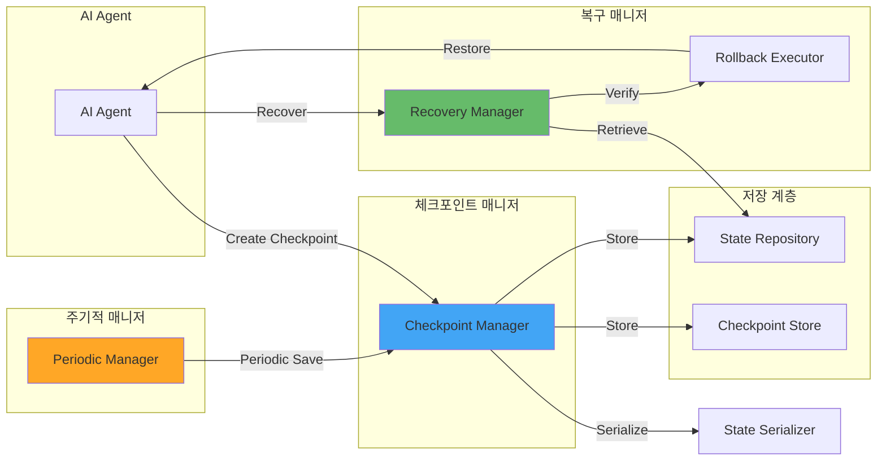
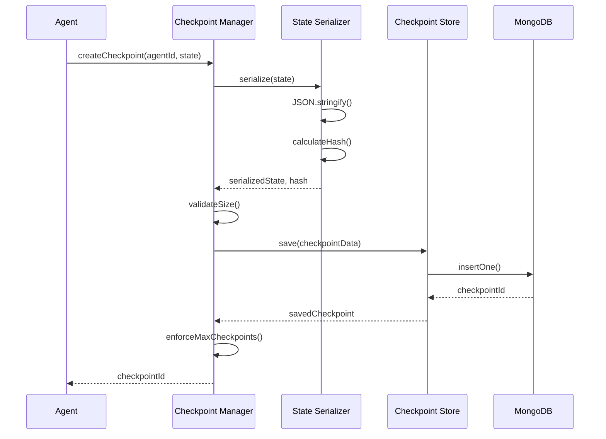
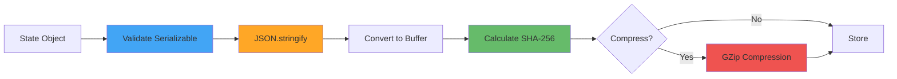
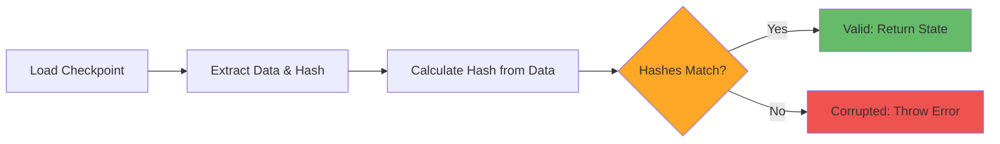
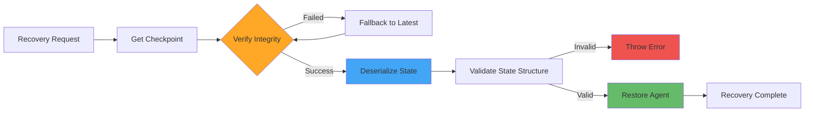
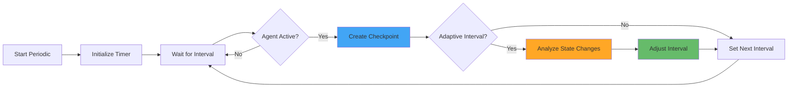

# Checkpointing System 아키텍처 문서

## 시스템 개요

Checkpointing System은 운영체제의 프로세스 체크포인팅(Checkpointing) 기법을 AI 에이전트의 장애 복구에 적용한 시스템입니다. 에이전트 상태 저장, 복구, 증분 백업을 통해 안정적인 AI 서비스 운영을 지원합니다.

---

## 1. 시스템 아키텍처

### 1.1 전체 구조



### 1.2 상태 저장 파이프라인



---

## 2. 체크포인트 타입

### 2.1 전체 체크포인트 (Full Checkpoint)

에이전트의 전체 상태를 저장합니다.

**장점**:
- 독립적인 복구 가능
- 복잡한 의존성 없음
- 이해하기 쉬움

**단점**:
- 저장 공간 많이 사용
- 생성 시간이 김

```typescript
{
  "type": "full",
  "state": {
    "messages": [...],
    "variables": {...},
    "executionPosition": {...}
  },
  "size": 5242880  // ~5MB
}
```

### 2.2 증분 체크포인트 (Incremental Checkpoint)

이전 체크포인트와의 차이만 저장합니다.

**장점**:
- 저장 공간 절약 (80-90% 감소)
- 빠른 생성 속도
- 네트워크 전송 최적화

**단점**:
- 기본 체크포인트 필요
- 복잡한 복구 과정
- 순차적 의존성

```typescript
{
  "type": "incremental",
  "baseCheckpointId": "ckpt-abc123",
  "diff": {
    "added": { "variables.counter": 6 },
    "removed": [],
    "modified": { "executionPosition.step": 4 }
  },
  "size": 524288  // ~512KB (90% 감소)
}
```

---

## 3. 상태 직렬화 (State Serialization)

### 3.1 직렬화 프로세스



### 3.2 직렬화 구현

```typescript
class StateSerializer {
  private maxSize: number;

  serialize(state: any): SerializedState {
    // 1. 직렬화 가능성 검증
    this.validateSerializable(state);

    // 2. JSON 변환
    const json = JSON.stringify(state);

    // 3. 버퍼 변환
    const buffer = Buffer.from(json, 'utf-8');

    // 4. 크기 검증
    if (buffer.length > this.maxSize) {
      throw new StateTooLargeError(buffer.length, this.maxSize);
    }

    // 5. 해시 계산
    const hash = this.calculateHash(buffer);

    return {
      data: buffer,
      size: buffer.length,
      hash,
      compressed: false
    };
  }

  deserialize(buffer: Buffer): any {
    // 1. 압축 해제 (필요시)
    const decompressed = this.decompressIfNeeded(buffer);

    // 2. 버퍼를 문자열로 변환
    const json = decompressed.toString('utf-8');

    // 3. JSON 파싱
    return JSON.parse(json);
  }

  private calculateHash(buffer: Buffer): string {
    return crypto.createHash('sha256').update(buffer).digest('hex');
  }

  private validateSerializable(state: any): void {
    const unsafe = [
      'function',
      'symbol',
      'undefined'
    ];

    const json = JSON.stringify(state);
    const parsed = JSON.parse(json);

    for (const type of unsafe) {
      if (this.containsType(parsed, type)) {
        throw new SerializationError(`Cannot serialize ${type}`);
      }
    }
  }
}
```

---

## 4. 무결성 검증 (Integrity Verification)

### 4.1 해시 기반 검증



### 4.2 검증 구현

```typescript
class IntegrityVerifier {
  verify(checkpoint: Checkpoint): VerificationResult {
    const { data, storedHash, checksum } = checkpoint;

    // 1. 데이터에서 해시 계산
    const calculatedHash = this.calculateHash(data);

    // 2. 저장된 해시와 비교
    const hashMatch = calculatedHash === storedHash;

    // 3. 체크섬 비교 (선택사항)
    const checksumMatch = checksum ? this.verifyChecksum(data, checksum) : true;

    return {
      isValid: hashMatch && checksumMatch,
      algorithm: 'sha256',
      calculatedHash,
      storedHash
    };
  }

  private calculateHash(buffer: Buffer): string {
    return crypto.createHash('sha256').update(buffer).digest('hex');
  }

  private verifyChecksum(buffer: Buffer, expectedChecksum: string): boolean {
    const calculated = this.calculateChecksum(buffer);
    return calculated === expectedChecksum;
  }

  private calculateChecksum(buffer: Buffer): string {
    // 간단한 체크섬 알고리즘 (예: CRC32)
    let checksum = 0;
    for (let i = 0; i < buffer.length; i++) {
      checksum = ((checksum << 8) ^ buffer[i]) & 0xFFFF;
    }
    return checksum.toString(16);
  }
}
```

---

## 5. 복구 프로세스 (Recovery Process)

### 5.1 복구 흐름



### 5.2 복구 매니저

```typescript
class RecoveryManager {
  constructor(
    private store: CheckpointStore,
    private repository: StateRepository,
    private rollbackExecutor: RollbackExecutor
  ) {}

  async recover(
    agentId: string,
    options: RecoveryOptions
  ): Promise<RecoveryResult> {
    const startTime = Date.now();

    try {
      // 1. 체크포인트 조회
      let checkpoint = await this.findCheckpoint(agentId, options.checkpointId);

      // 2. 무결성 검증
      if (options.verifyIntegrity) {
        const isValid = await this.verifyIntegrity(checkpoint);
        if (!isValid && options.fallbackToLatest) {
          checkpoint = await this.getLatestCheckpoint(agentId);
        }
      }

      // 3. 상태 복원
      const restoredState = await this.rollbackExecutor.execute(checkpoint);

      // 4. 실행 위치 복원
      await this.restoreExecutionPosition(agentId, restoredState);

      return {
        success: true,
        restoredState,
        recoveryTime: Date.now() - startTime,
        checkpointUsed: checkpoint.checkpointId
      };

    } catch (error) {
      return {
        success: false,
        error: error.message,
        recoveryTime: Date.now() - startTime
      };
    }
  }

  private async findCheckpoint(
    agentId: string,
    checkpointId?: string
  ): Promise<Checkpoint> {
    if (checkpointId) {
      return await this.repository.findById(checkpointId);
    }
    return await this.repository.findLatestByAgent(agentId);
  }

  private async verifyIntegrity(checkpoint: Checkpoint): Promise<boolean> {
    const verifier = new IntegrityVerifier();
    const result = verifier.verify(checkpoint);
    return result.isValid;
  }

  private async restoreExecutionPosition(
    agentId: string,
    state: any
  ): Promise<void> {
    const { executionPosition } = state;

    if (executionPosition) {
      // 실행 위치 복원 로직
      await this.jumpToPosition(agentId, executionPosition);
    }
  }
}
```

---

## 6. 주기적 체크포인트 (Periodic Checkpointing)

### 6.1 주기적 저장 전략



### 6.2 주기적 매니저

```typescript
class PeriodicCheckpointManager {
  private timers: Map<string, NodeJS.Timeout> = new Map();

  constructor(
    private checkpointManager: CheckpointManager,
    private config: PeriodicConfig
  ) {}

  async start(agentId: string): Promise<void> {
    if (this.timers.has(agentId)) {
      throw new Error('Periodic checkpointing already started');
    }

    const createPeriodicCheckpoint = async () => {
      try {
        const state = await this.captureAgentState(agentId);

        if (!this.config.idleCheckpointsEnabled) {
          const isActive = await this.isAgentActive(agentId);
          if (!isActive) return;
        }

        if (this.config.adaptiveInterval) {
          const changeRate = this.calculateChangeRate(state);
          if (changeRate < 0.1) {
            // 상태 변경이 적으면 다음 주기로 건너뜀
            return;
          }
        }

        await this.checkpointManager.createCheckpoint(agentId, state, {
          type: 'incremental',
          description: 'Periodic checkpoint',
          tags: ['periodic', 'auto']
        });

      } catch (error) {
        console.error(`Periodic checkpoint failed for ${agentId}:`, error);
      }
    };

    const timer = setInterval(
      createPeriodicCheckpoint,
      this.config.intervalMs
    );

    this.timers.set(agentId, timer);
  }

  async stop(agentId: string): Promise<void> {
    const timer = this.timers.get(agentId);
    if (timer) {
      clearInterval(timer);
      this.timers.delete(agentId);
    }
  }

  private calculateChangeRate(state: any): number {
    // 상태 변경률 계산 (0-1)
    const previous = this.previousStates.get(agentId);
    if (!previous) return 1.0;

    const changes = this.countDifferences(previous, state);
    const total = this.countProperties(state);

    return changes / total;
  }

  private countDifferences(obj1: any, obj2: any): number {
    let differences = 0;

    for (const key in obj2) {
      if (obj1[key] !== obj2[key]) {
        differences++;
      }
    }

    return differences;
  }

  private countProperties(obj: any): number {
    return Object.keys(obj).length;
  }
}
```

---

## 7. 성능 최적화

### 7.1 압축 전략

```typescript
class CompressionStrategy {
  compress(buffer: Buffer): Buffer {
    return zlib.gzipSync(buffer);
  }

  decompress(buffer: Buffer): Buffer {
    return zlib.gunzipSync(buffer);
  }

  shouldCompress(size: number): boolean {
    // 1MB 이상이면 압축
    return size > 1048576;
  }

  getCompressionRatio(original: Buffer, compressed: Buffer): number {
    return compressed.length / original.length;
  }
}
```

### 7.2 체크포인트 정책

```typescript
class CheckpointPolicy {
  async enforceMaxCheckpoints(
    agentId: string,
    maxCheckpoints: number
  ): Promise<void> {
    const checkpoints = await this.repository.findByAgent(agentId);

    if (checkpoints.length > maxCheckpoints) {
      // 오래된 체크포인트 삭제
      const toDelete = checkpoints
        .sort((a, b) => a.timestamp.getTime() - b.timestamp.getTime())
        .slice(0, checkpoints.length - maxCheckpoints);

      for (const checkpoint of toDelete) {
        await this.repository.delete(checkpoint.checkpointId);
      }
    }
  }

  async cleanupExpiredCheckpoints(): Promise<void> {
    const expired = await this.repository.findExpired();

    for (const checkpoint of expired) {
      await this.repository.delete(checkpoint.checkpointId);
    }
  }
}
```

---

## 8. 기술 스택

| 계층 | 기술 | 버전 | 용도 |
|------|------|------|------|
| 언어 | TypeScript | 5.3+ | 타입 안전성 |
| 런타임 | Node.js | 20 LTS | 서버 런타임 |
| 웹 프레임워크 | Express.js | 4.x | REST API |
| 데이터베이스 | MongoDB | 7.0+ | 영구 저장 |
| 검증 | Zod | 3.x | 스키마 검증 |
| 테스트 | Jest | 29.x | 단위/통합 테스트 |

---

## 9. OS 개념 매핑

| OS 개념 | 적용 | 구현 |
|---------|------|------|
| Process State | Agent State | 에이전트 상태 |
| Checkpoint | Checkpoint | 상태 스냅샷 |
| Restore | Recovery | 상태 복원 |
| Incremental Backup | Incremental Checkpoint | 차이 저장 |
| Integrity Check | Hash Verification | 무결성 검증 |

---

**문서 버전**: 1.0.0
**최종 업데이트**: 2025-01-25
**유지보수 담당자**: Checkpointing 팀
